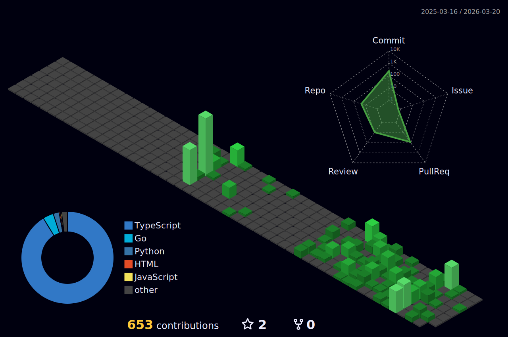

<div align="center">

[](https://github.com/windro-xdd)
&nbsp;
[](https://github.com/windro-xdd?tab=followers)

</div>

<!-- TERMINAL-STYLE ABOUT -->
<br/>

```
┌──(windro㉿xd)-[~]
└─$ cat /etc/profile

  ROLE       : Penetration Tester & Security Researcher
  EDUCATION  : BCA @ Yenepoya University, Bengaluru
  FOCUS      : Web Pentesting | Wireless Security | Exploit Dev
  EXPLORING  : Cloud Security | IoT Hacking | Red Team Ops
  GOAL       : Security Architect / CISO
  
  STATUS     : Building tools that break things (ethically)

┌──(windro㉿xd)-[~]
└─$ uptime
  up since 2024, currently grinding...
```

<!-- TECH ARSENAL -->
## ⚙️ Tech Arsenal

<div align="center">

### Offensive Security
[](https://skillicons.dev)

### Development
[](https://skillicons.dev)

### Infrastructure
[](https://skillicons.dev)

### Tools & Platforms
[](https://skillicons.dev)

</div>

<!-- PROJECTS -->
## 🔬 Featured Arsenal

<div align="center">
<table>
<tr>
<td width="50%">

<h3 align="center">Enigma (ESP32)</h3>
<p align="center">
  <a href="https://github.com/windro-xdd" target="_blank">
    
  </a>
</p>
<p align="center">Wi-Fi, BLE & RFID scanning toolkit built on ESP32. Hardware meets hacking.</p>

</td>
<td width="50%">

<h3 align="center">ShadowLure</h3>
<p align="center">
  <a href="https://github.com/windro-xdd" target="_blank">
    
  </a>
</p>
<p align="center">Multi-service Python honeypot framework. Trap, log, analyze threat actors.</p>

</td>
</tr>
<tr>
<td width="50%">

<h3 align="center">AdvExploit</h3>
<p align="center">
  <a href="https://github.com/windro-xdd" target="_blank">
    
  </a>
</p>
<p align="center">Web vulnerability scanner with Nmap integration. Recon to report.</p>

</td>
<td width="50%">

<h3 align="center">More in Repos ↓</h3>
<p align="center">
  <a href="https://github.com/windro-xdd?tab=repositories" target="_blank">
    
  </a>
</p>
<p align="center">Security tools, CTF writeups, and more.</p>

</td>
</tr>
</table>
</div>

<!-- CERTIFICATIONS -->
## 🏅 Certifications

<div align="center">


&nbsp;


</div>

<!-- GITHUB METRICS -->
## 📊 Metrics

<div align="center">

<a href="https://github.com/windro-xdd">
  
</a>

<br/><br/>

<!-- Streak Stats -->
<a href="https://github.com/windro-xdd">
  
</a>

<br/><br/>

<!-- Activity Graph -->
<a href="https://github.com/windro-xdd">
  
</a>

<br/><br/>

<!-- Trophies -->
<a href="https://github.com/windro-xdd">
  
</a>

</div>

<!-- CYBER QUOTE -->
<br/>
<div align="center">

[](https://github.com/hackelite01/github-readme-cyber-quotes)

</div>

<!-- 3D CONTRIBUTION GRAPH -->
## 🧊 3D Contributions

<div align="center">



</div>

<!-- SNAKE ANIMATION -->
<div align="center">

<picture>
  <source media="(prefers-color-scheme: dark)" srcset="https://raw.githubusercontent.com/windro-xdd/windro-xdd/output/github-snake-dark.svg" />
  <source media="(prefers-color-scheme: light)" srcset="https://raw.githubusercontent.com/windro-xdd/windro-xdd/output/github-snake.svg" />
  
</picture>

</div>

<!-- CONNECT -->
## 📡 Connect

<div align="center">

[](mailto:spsidharth29@gmail.com)
&nbsp;
[](https://linkedin.com/in/sidharth-sp-99501232a)
&nbsp;
[](https://windroxd.site)
&nbsp;
[](https://github.com/windro-xdd)

</div>

<br/>


